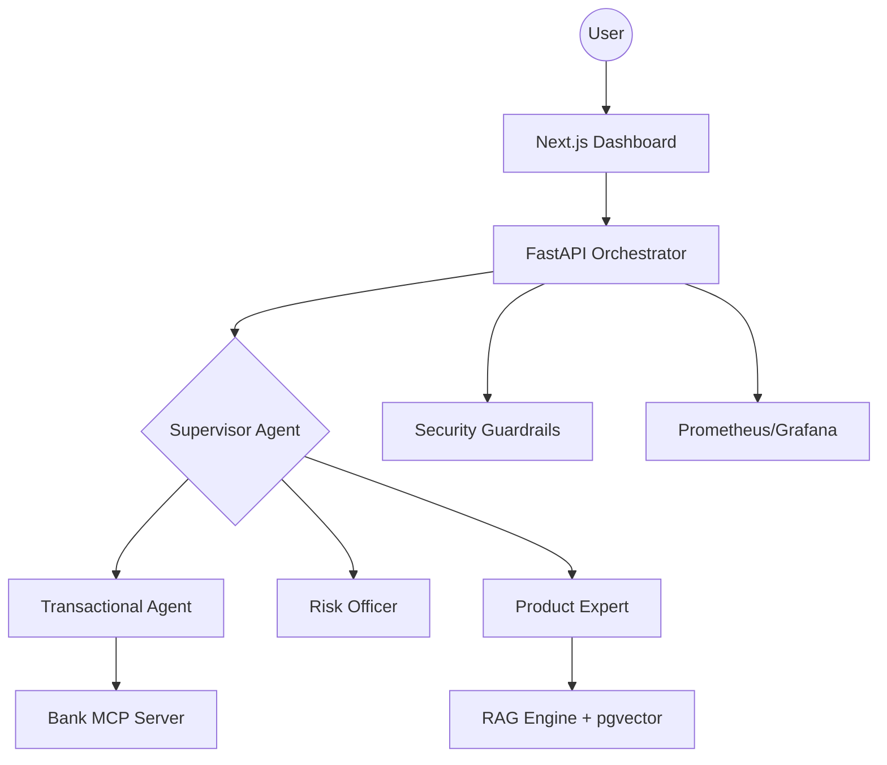

# FinAgent: Autonomous Multi-Agent Banking Framework 🏦🤖

[](https://github.com/langchain-ai/langgraph)
[](https://fastapi.tiangolo.com/)
[](https://github.com/pgvector/pgvector)
[](https://github.com/explodinggradients/ragas)

**FinAgent** is a production-grade, autonomous multi-agent system designed for secure financial operations. It leverages **LangGraph** for sophisticated agent orchestration, providing a transparent, secure, and observable AI banking experience.

## 🌟 Key Features

- **Autonomous Agent Orchestration**: Uses a Supervisor-Agent pattern to route requests between specialized agents (Banker, Risk Officer, Product Expert).
- **Modular Semantic Search**: High-performance RAG pipeline with `pgvector` hybrid search and ingestion indexing.
- **Enterprise Security**: 
  - **PII Data Masking**: Automatically redacts sensitive information.
  - **Security Auditing**: Real-time logging of every AI action.
  - **Guardrails**: Protection against SQLi, XSS, and unauthorized transactions.
- **Observability Hub**: 
  - **Real-time Thought Diaries**: Watch the AI "think" through every node transition.
  - **Prometheus/Grafana Integration**: Monitor latency, request counts, and system health.
- **Data-Driven Evaluation**: Integrated **RAGAS** suite for measuring faithfulness, relevance, and precision.

## 🏗️ Architecture



## 🚀 Quick Start

### Prerequisites
- Docker & Docker Compose
- OpenAI API Key (added to `backend/.env`)

### Installation
1. Clone the repository:
   ```bash
   git clone https://github.com/yourusername/finagent.git
   cd finagent
   ```
2. Setup environment variables:
   - Create `backend/.env` with your `OPENAI_API_KEY`.
3. Run with Docker Compose:
   ```bash
   docker compose up --build
   ```
4. Access the apps:
   - **Frontend**: `http://localhost:3000`
   - **API Metrics**: `http://localhost:8000/metrics`
   - **Grafana Dashboard**: `http://localhost:3001`

## 📊 Evaluation (RAGAS)
Run the evaluation suite to measure system performance:
```bash
docker exec -it fin-agent-backend python backend/eval/evaluator.py
```

## 🛡️ Security Audit
Every transaction and AI response is logged in `backend/data/audit_logs.jsonl` for compliance and auditing.

---
Built with ❤️ for the future of Autonomous Finance.
