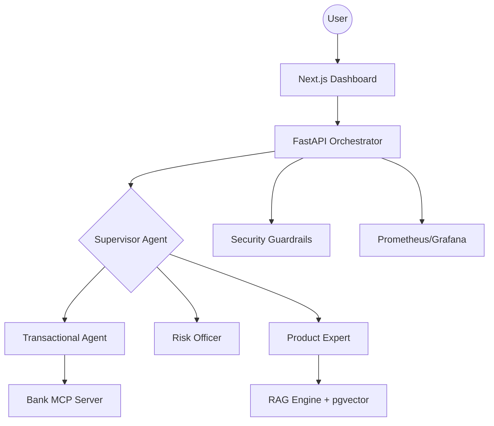

# FinAgent: Autonomous Multi-Agent Banking Framework 🏦🤖

[](https://github.com/langchain-ai/langgraph)
[](https://fastapi.tiangolo.com/)
[](https://github.com/pgvector/pgvector)
[](https://github.com/explodinggradients/ragas)

**FinAgent** is a production-grade, autonomous multi-agent system designed for secure financial operations. It leverages **LangGraph** for sophisticated agent orchestration, providing a transparent, secure, and observable AI banking experience.

## 🌟 Key Features

- **Autonomous Agent Orchestration**: Uses a Supervisor-Agent pattern to route requests between specialized agents (Banker, Risk Officer, Product Expert).
- **Modular Semantic Search**: High-performance RAG pipeline with `pgvector` hybrid search and ingestion indexing.
- **Enterprise Security**: 
  - **PII Data Masking**: Automatically redacts sensitive information.
  - **Security Auditing**: Real-time logging of every AI action.
  - **Guardrails**: Protection against SQLi, XSS, and unauthorized transactions.
- **Observability Hub**: 
  - **Real-time Thought Diaries**: Watch the AI "think" through every node transition.
  - **Prometheus/Grafana Integration**: Monitor latency, request counts, and system health.
- **Data-Driven Evaluation**: Integrated **RAGAS** suite for measuring faithfulness, relevance, and precision.

## 🏗️ Architecture



## 🚀 Quick Start

### Prerequisites
- Docker & Docker Compose
- OpenAI API Key (added to `backend/.env`)

### Installation
1. Clone the repository:
   ```bash
   git clone https://github.com/yourusername/finagent.git
   cd finagent
   ```
2. Setup environment variables:
   - Create `backend/.env` with your `OPENAI_API_KEY`.
3. Run with Docker Compose:
   ```bash
   docker compose up --build
   ```
4. Access the apps:
   - **Frontend**: `http://localhost:3000`
   - **API Metrics**: `http://localhost:8000/metrics`
   - **Grafana Dashboard**: `http://localhost:3001`

## 🏗️ Architecture Deep Dive

This section provides an exhaustive technical analysis of the FinAgent ecosystem, covering design patterns, data flow, and security infrastructure.

### 1. Advanced Agent Orchestration (LangGraph)
Unlike linear LLM chains, FinAgent uses a **Directed Acyclic Graph (DAG)** with cyclic capabilities to manage complex workflows:
- **Stateful Management**: The `AgentState` object persists across node transitions, holding message history, user context (ID, credit score), and internal flags (e.g., `is_risk_cleared`).
- **Supervisor Pattern**: A central `supervisor_node` acts as an intelligent router. It uses an LLM to analyze the intent and dispatch the task to specialized nodes, reducing "noise" and improving tool-calling reliability.
- **Node Specialization**:
  - **Banker**: Focused on tool execution (transfers, balance checks).
  - **Risk Officer**: Statistically analyzes transaction risks.
  - **Product Expert**: Performs RAG searches for banking knowledge.

### 2. Model Context Protocol (MCP) & Tooling
The system uses `fastmcp` to expose banking functions as tools. 
- **Decoupling**: The core banking logic is isolated in a separate MCP server, simulating a real-world legacy banking API.
- **Dynamic Selection**: The AI Banker doesn't just "run" a tool; it decides *which* tool to use based on the tool's docstrings, showcasing the model's reasoning capabilities.

### 3. RAG Infrastructure (pgvector)
We chose **PostgreSQL with pgvector** over specialized vector databases (like Pinecone) for several reasons:
- **ACID Compliance**: Ensuring financial data integrity alongside vector embeddings.
- **Hybrid Queries**: Allows for joining relational data (user accounts) with unstructured data (product docs) in a single SQL query.
- **Semantic Search**: Implemented via `SentenceTransformer` embeddings, providing high-relevance retrieval for product inquiries.

### 4. 3-Layer Security Guardrails
FinAgent implements a defense-in-depth strategy:
1. **PII Masking**: A regex + LLM hybrid layer that redacts IBANs, phone numbers, and emails before they are processed by external LLMs.
2. **Input Validation**: Hardened against Prompt Injection, SQLi, and XSS through structured Pydantic models and input sanitization.
3. **Audit Trails**: Every node transition and AI decision is serialized into `audit_logs.jsonl`, providing a 100% transparent history for compliance.

### 5. Observability & SRE Stack
- **Prometheus**: Automatically instruments FastAPI endpoints to track `http_request_duration_seconds` and `http_requests_total`.
- **Grafana**: Visualizes system health, agent latency, and security event frequency.
- **Streaming SSE**: The frontend uses Server-Sent Events to stream "AI Thoughts" in real-time, providing a high-fidelity look into the agent's internal reasoning process.

### 6. Automated Evaluation (RAGAS)
To move beyond "vibe-based" testing, we use the RAGAS framework:
- **Faithfulness**: How much of the answer is grounded in the provided context?
- **Answer Relevance**: How well does the answer address the actual user query?
- **Context Precision**: Is the retrieved context actually useful for the answer?

## 📊 Evaluation (RAGAS)
Run the evaluation suite to measure system performance:
```bash
docker exec -it fin-agent-backend python backend/eval/evaluator.py
```

## 🛡️ Security Audit
Every transaction and AI response is logged in `backend/data/audit_logs.jsonl` for compliance and auditing.

---
Built with ❤️ for the future of Autonomous Finance.
